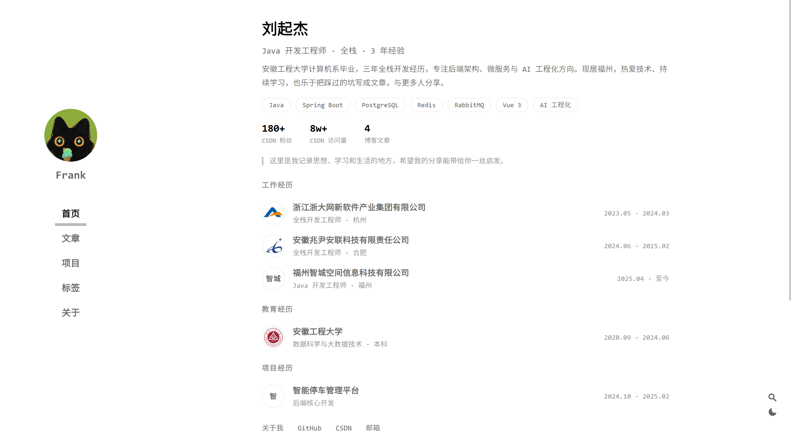
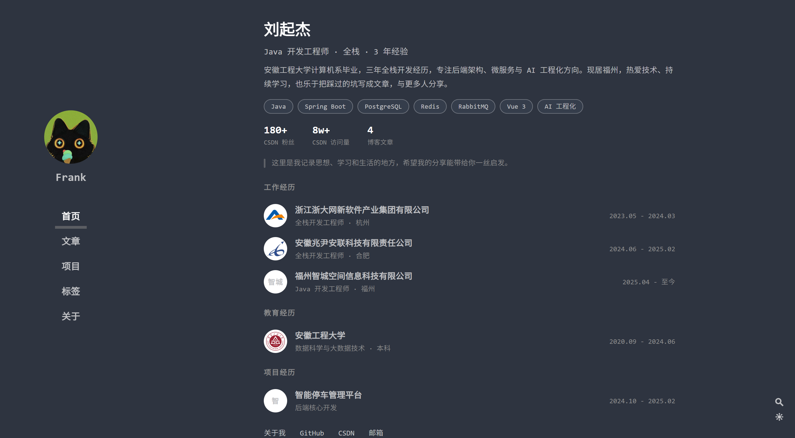
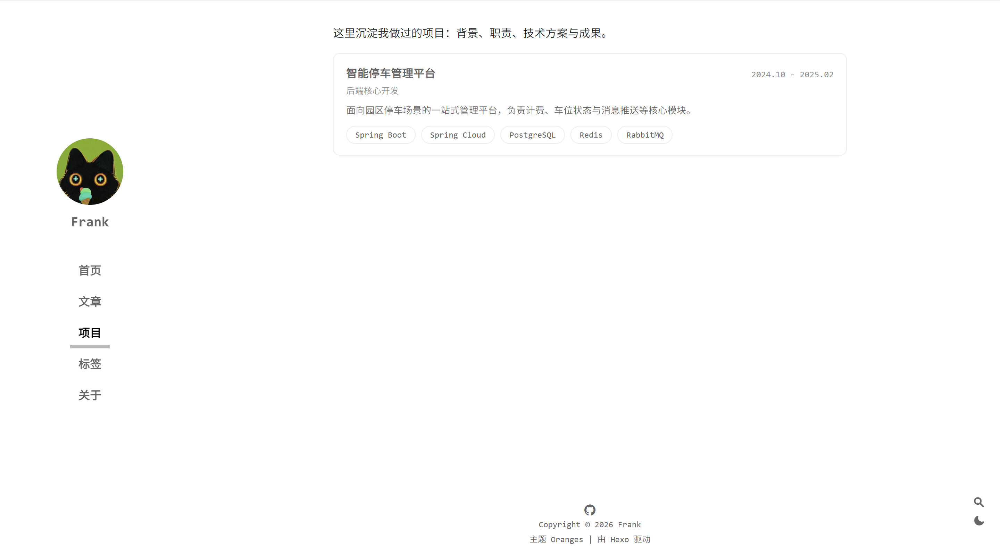
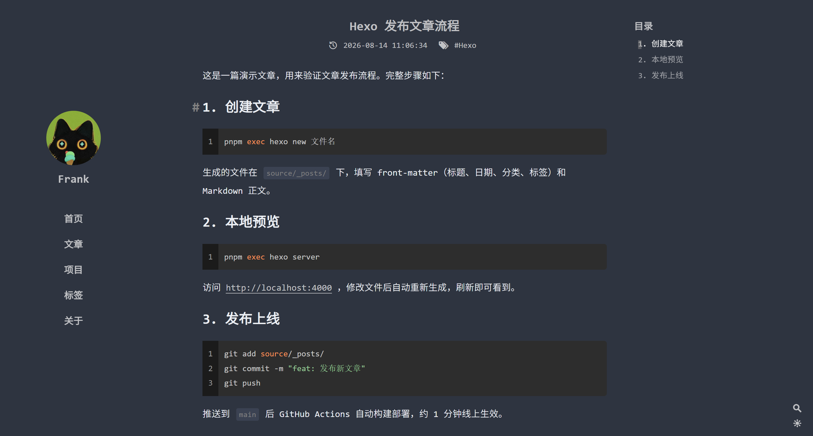
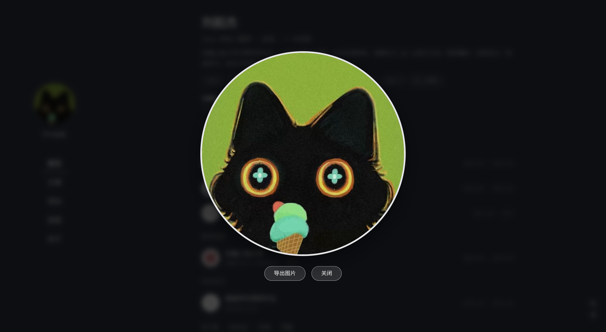

# Frank's Notes

个人技术博客与项目作品集：**[https://frank-dev.site](https://frank-dev.site)**

记录 Java 后端、全栈开发、AI 工程化和 GIS 服务开发中的实践，也整理可复用的工程技能与技术图解。

   

## 在线预览

- [首页](https://frank-dev.site/)
- [文章归档](https://frank-dev.site/archives/)
- [项目经历](https://frank-dev.site/projects/)
- [Skill-Hub](https://frank-dev.site/skills/)
- [关于我](https://frank-dev.site/about/)

### 首页 · 浅色模式



### 首页 · 深色模式



首页包含富简介区：姓名与职位、个人简介、技能标签、数据概览、教育与工作经历（按时间排序并展示机构 logo）、项目经历和常用链接。

### 项目经历页



每个项目是一篇 Markdown 文章，卡片展示期间、角色、简介与技术栈，点击后进入项目详情。

### 文章阅读



文章页提供目录滚动高亮、代码高亮与复制、标签、上一篇/下一篇导航，以及可选的 AI 阅读助手。

### 头像查看器



点击侧栏头像可放大查看并导出图片，按 `Esc` 或点击背景关闭。

## 核心能力

- **内容与作品集**：博客文章与项目经历分开维护，首页和 `/projects/` 会自动聚合项目文章。
- **专栏归档**：`/archives/` 支持按时间和按技术专栏分组两种视图；分组依据文章在 `source/_posts/articles/` 下的目录。
- **本地全文搜索**：浏览器加载 Hexo 生成的 `search.xml`，支持多关键词、相关性排序、摘要、关键词高亮和键盘导航。
- **阅读体验**：目录滚动高亮、代码复制、锚点平滑滚动、上一篇/下一篇、RSS 订阅和响应式布局。
- **深浅主题**：支持浅色/深色切换与 View Transitions 动画；不支持该 API 或设置了 `prefers-reduced-motion` 时会降级。
- **AI 阅读助手**：文章页基于当前文章全文问答，支持 SSE 流式输出、推理过程、多轮追问、停止生成、错误提示和代码块渲染。
- **Skill-Hub**：扫描仓库中的可复用技能，生成 `/skills/` 目录和技能详情页；技能正文 `SKILL.md` 不会作为静态文件直接发布。
- **自动部署**：推送 `main` 分支或手动运行 GitHub Actions，构建后发布到 GitHub Pages。

## 内容地图

当前内容主要分为以下专栏和连载系列：

| 专栏/系列 | 内容 |
| --- | --- |
| Java | 多线程从零到一、接口限流、千万级大表迁移等后端实践 |
| Spring / Spring Boot | IoC+AOP 双支柱、事务失效全解、网关限流熔断 |
| RuoYi 从零到一 | 若依框架从环境搭建到模块二开的学习实践，共 12 篇 |
| MongoDB 从零到一 | 规划 12 篇，已发布 6 篇：选型定位、Docker 与 mongosh、CRUD 操作符、数据建模、聚合管道（上/下） |
| MySQL / Redis / RabbitMQ / Oracle / Elasticsearch | 数据库、中间件、搜索引擎和高并发基础与实践（MySQL 9 篇、Redis 6 篇、RabbitMQ 4 篇、ES 10 篇） |
| Vue 从零到一 | Vue 3 生命周期、模板指令、响应式、组件通信、Router、Pinia、Axios 联调、Vite 上线，共 9 篇（含番外：构建工具全景） |
| LangChain4j | Java 视角的对话、工具调用和 RAG，共 3 篇 |
| AI / RESTful / MinIO / SSE / 数据库选型 | AI 应用、接口设计、对象存储、实时通信与三大关系库选型对比 |
| 项目经历 | 数据中心、AI 智能客服助手、GDAL/GIS 服务等项目复盘 |

成体系教程可以从[关于页的系列文章目录](https://frank-dev.site/about/)开始按顺序阅读。文章配图统一使用文章同名资源目录维护，当前包含大量科研论文风格 SVG 技术图解。

## 技术栈

| 组件 | 说明 |
| --- | --- |
| [Hexo 8](https://hexo.io/) | 静态站点生成器，版本锁定在 `8.1.2` |
| [Oranges 主题](https://github.com/zchengsite/hexo-theme-oranges) | 本地化深度定制，主题许可证为 MIT |
| EJS + 原生 JavaScript | 页面模板、交互和搜索实现 |
| pnpm `11.17.0` | 依赖安装与脚本执行 |
| GitHub Actions + GitHub Pages | 自动构建与部署 |

## 目录结构

```text
Frank.dev/
├── _config.yml               # Hexo 站点配置、文章资源和生成目录设置
├── _config.oranges.yml       # 主题配置：首页资料、导航、搜索、AI 等
├── package.json               # Hexo 版本与 pnpm 脚本
├── pnpm-lock.yaml             # 锁定依赖版本
├── scaffolds/                 # post / draft / project / page 写作脚手架
├── scripts/skills.js          # 扫描技能并生成 /skills/ 页面
├── docs/screenshots/          # README 截图
├── .agents/skills/            # ZCode 工作区技能（优先级较高）
├── source/
│   ├── _posts/articles/       # 博客文章；子目录名即归档专栏
│   ├── _posts/projects/       # 项目文章，需使用 categories: [项目经历]
│   ├── about/                 # 关于页与系列文章入口
│   ├── projects/              # 项目经历列表页
│   ├── skills/                # 站点保存的技能副本与对外 README
│   ├── images/                # 头像、favicon、机构 logo 和公共图片
│   └── CNAME                  # GitHub Pages 自定义域名
├── themes/oranges/
│   ├── layout/                # EJS 页面与局部模板
│   ├── source/css/            # 主题样式
│   ├── source/js/             # 主题脚本
│   ├── source/plugins/        # 第三方前端插件，如 clipboard
│   └── languages/             # zh-CN / default 文案
└── .github/workflows/deploy.yml # GitHub Pages 构建与部署
```

`public/` 是 Hexo 生成的构建产物，`db.json` 是本地缓存，两者均被 `.gitignore` 排除，不应直接编辑或提交。

## 本地开发

### 环境要求

- Node.js 22（与 CI 保持一致）
- pnpm `11.17.0`

确认 pnpm 版本后安装依赖：

```bash
pnpm --version
pnpm install
```

常用命令：

```bash
pnpm server          # 启动开发服务器：http://localhost:4000
pnpm build           # 生成静态文件至 public/
pnpm clean           # 清理 public/ 和 Hexo 缓存
```

CI 使用 `pnpm install --frozen-lockfile`，依赖锁文件发生变化时请一并提交 `pnpm-lock.yaml`。本仓库使用 pnpm，不需要通过 npm 执行这些命令。

## 写作指南

### 博客文章

生成文章后，将文件放入 `source/_posts/articles/<专栏>/`：

```bash
pnpm exec hexo new post "文章标题"
# 例如：移入 source/_posts/articles/Redis/
```

```yaml
---
title: 文章标题
date: 2026-08-24 10:00:00
categories: [教程]
tags: [Redis]
description: 一句话摘要
---
```

文章所在的二级目录会进入归档页的“按分组”视图。新增专栏时，若需要自定义中文展示名，请同步修改 `themes/oranges/layout/archive.ejs` 中的 `groupDisplayNames`。

文章配图和其他资源放在与 Markdown 文件同名的目录中，并在正文使用相对路径：

```text
source/_posts/articles/Redis/
├── 01-redis-intro-and-data-structures.md
└── 01-redis-intro-and-data-structures/
    └── redis-data-structure.svg
```

```markdown

```

站点启用了 `post_asset_folder` 和 `marked.postAsset`，构建后资源会跟随文章 URL 发布。

### 项目经历

```bash
pnpm exec hexo new project "项目名称"
# 移入 source/_posts/projects/
```

```yaml
---
title: 项目名称
categories: [项目经历]     # 项目聚合的识别标记，勿改
period: 2024.10 - 2025.02
role: 后端核心开发
stack: [Spring Boot, Redis] # YAML 列表
description: 一句话项目简介
---
```

项目正文建议按“项目背景、职责、技术方案、难点与成果”组织。首页“项目经历”区块和 `/projects/` 页面会自动读取 `period`、`role`、`stack`、`description`，无需另外维护列表配置。

### Skill-Hub 技能

技能目录由 `scripts/skills.js` 在构建时扫描，来源按以下顺序处理：

1. `.agents/skills/<slug>/SKILL.md`
2. `source/skills/<slug>/SKILL.md`

同名技能只保留优先级更高的第一份。`SKILL.md` 的 Front Matter 至少需要 `name` 和 `description`，用于生成 `/skills/` 索引；同目录的 `README.md` 会生成技能详情页。`source/skills/**` 在 `_config.yml` 中被排除，因此 `SKILL.md` 正文不会被原样发布。

## 主题定制

- 首页简介、个人资料、教育/工作经历、导航和链接：`_config.oranges.yml` 的 `intro`、`navbar`。
- 目录、上一篇/下一篇、搜索、代码复制、深浅主题和 AI 阅读助手：同一文件中的对应开关。
- 全局头像与 favicon 当前都指向 `source/images/favicon.png`；机构 logo 和其他公共图片也放在 `source/images/`。
- 标签页和标签渲染仍然保留，但默认不显示在主导航；在 `_config.oranges.yml` 中将 `navbar` 的标签项设为 `enable: true` 即可启用入口。
- 页面模板位于 `themes/oranges/layout/`，样式和脚本分别位于 `themes/oranges/source/css/`、`themes/oranges/source/js/`。

## AI 阅读助手

AI 助手只在文章详情页渲染，并且必须同时满足 `aiChat.enable`、接口地址和 API key 均有效。当前配置使用硅基流动的 OpenAI 兼容接口，API key 直接写在 `_config.oranges.yml` 中：

```yaml
aiChat:
  enable: true
  endpoint: "https://api.siliconflow.cn/v1/chat/completions"
  apiKey: "sk-xxxx"       # 直接填写硅基流动 API Key
  model: "THUDM/GLM-4-9B-0414"
  stream: true
  maxContextTurns: 6
```

不再使用 `AI_CHAT_KEY` 环境变量或 GitHub Secrets 注入；修改配置后重启 `pnpm server` 生效。

### 本地预览

```bash
pnpm server
```

如果 4000 端口被占用：

```bash
pnpm exec hexo server -p 4321
```

### 安全说明

静态博客没有后端，API key 会随页面源码公开，也会随仓库公开——这是当前方案明确接受的取舍。请使用独立、低额度、严格限流的 key，不要与其他付费服务共用。若要彻底避免 key 暴露，应改为服务端代理转发模型请求。

## 部署

`.github/workflows/deploy.yml` 在以下情况下运行：

- 推送到 `main` 分支；
- 在 GitHub Actions 页面手动触发 `workflow_dispatch`。

CI 使用 Node.js 22、pnpm `11.17.0` 和 `pnpm install --frozen-lockfile`，执行 Hexo 构建后将 `public/` 上传到 GitHub Pages。自定义域名由 `source/CNAME` 提供。

## 许可

- 站点文章、项目内容和原创配图版权归 [Frank](https://github.com/RainbowJier) 所有。
- 主题基于 [hexo-theme-oranges](https://github.com/zchengsite/hexo-theme-oranges) 定制，遵循 MIT License，详见 `themes/oranges/LICENSE`。
