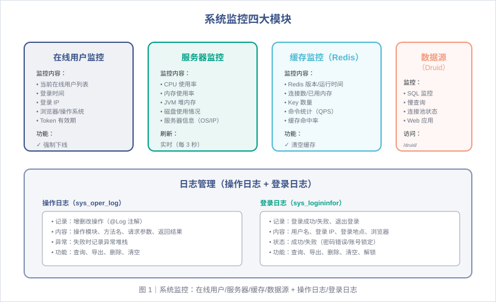
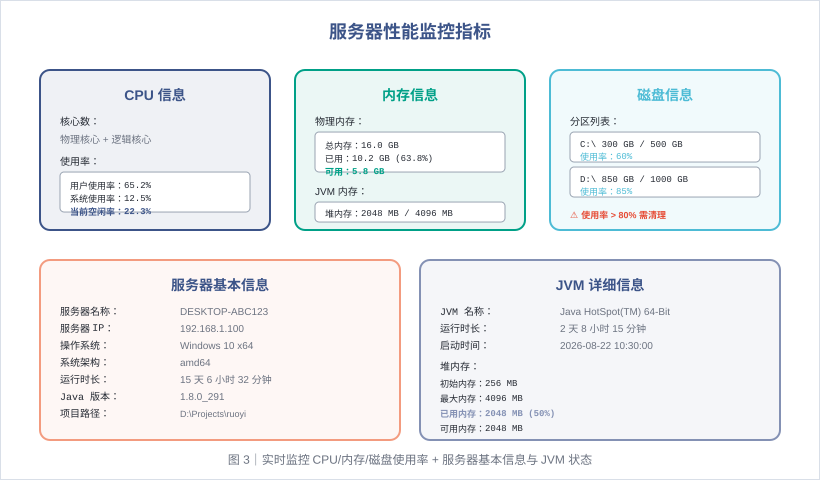
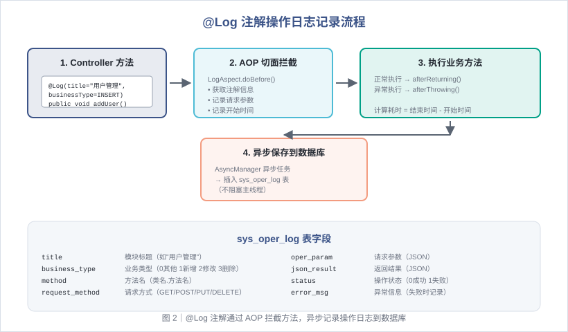
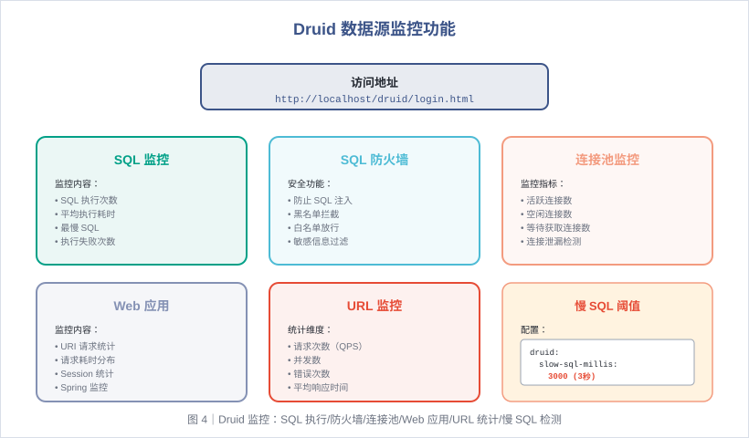

> **适合人群**：已理解 RuoYi 基础架构，需要实现系统监控、日志审计、性能分析的同学
> 本文是《RuoYi 框架从零到一》系列第 07 篇，基于 RuoYi-Vue 4.x 版本。
>
> 建议先读 。

## 一、系统监控概览

RuoYi 提供了 **4 大监控模块**，帮助运维人员实时掌握系统状态。



### 1.1 四大监控模块

| 模块 | 说明 | 访问路径 |
|------|------|---------|
| **在线用户监控** | 查看当前在线用户、强制下线 | 系统监控 → 在线用户 |
| **服务器监控** | CPU、内存、JVM、磁盘实时状态 | 系统监控 → 服务监控 |
| **缓存监控** | Redis 连接、内存、Key 数量、命令统计 | 系统监控 → 缓存监控 |
| **数据源监控** | Druid SQL 监控、慢查询、连接池状态 | 系统监控 → 数据监控 |

### 1.2 两大日志模块

| 模块 | 说明 | 访问路径 |
|------|------|---------|
| **操作日志** | 记录增删改操作（@Log 注解） | 系统监控 → 操作日志 |
| **登录日志** | 记录登录成功/失败、退出登录 | 系统监控 → 登录日志 |

---

## 二、在线用户监控

### 2.1 功能说明

**在线用户监控** 实时展示当前登录用户列表，支持 **强制下线**。

**核心功能**：

- 查看在线用户列表（用户名、部门、登录 IP、登录地点、浏览器、操作系统、登录时间）
- 强制下线（删除 Redis 中的 Token）

### 2.2 实现原理

#### （1）登录时记入 Redis

用户登录成功后，生成 Token，将用户信息存入 Redis：

```java
// TokenService.java
public void setLoginUser(LoginUser loginUser) {
    if (StringUtils.isNotNull(loginUser) && StringUtils.isNotEmpty(loginUser.getToken())) {
        String userKey = getTokenKey(loginUser.getToken());
        redisCache.setCacheObject(userKey, loginUser);
    }
}

// Key 格式：login_tokens:uuid
private String getTokenKey(String uuid) {
    return CacheConstants.LOGIN_TOKEN_KEY + uuid;
}
```

**Redis 数据结构**：

```
Key: login_tokens:12345678-1234-1234-1234-123456789abc
Value: {
  "token": "12345678-1234-1234-1234-123456789abc",
  "userId": 1,
  "username": "admin",
  "loginTime": 1692864000000,
  "expireTime": 1692950400000,
  "ipaddr": "127.0.0.1",
  "loginLocation": "内网IP",
  "browser": "Chrome 10",
  "os": "Windows 10"
}
```

#### （2）查询在线用户

扫描 Redis 中所有 `login_tokens:*` 的 Key，返回在线用户列表：

```java
// SysUserOnlineServiceImpl.java
public List<SysUserOnline> selectOnlineList() {
    Collection<String> keys = redisCache.keys(CacheConstants.LOGIN_TOKEN_KEY + "*");
    List<SysUserOnline> userOnlineList = new ArrayList<>();
    for (String key : keys) {
        LoginUser loginUser = redisCache.getCacheObject(key);
        if (loginUser != null) {
            SysUserOnline userOnline = new SysUserOnline();
            userOnline.setTokenId(loginUser.getToken());
            userOnline.setUserName(loginUser.getUsername());
            userOnline.setIpaddr(loginUser.getIpaddr());
            userOnline.setLoginLocation(loginUser.getLoginLocation());
            userOnline.setBrowser(loginUser.getBrowser());
            userOnline.setOs(loginUser.getOs());
            userOnline.setLoginTime(loginUser.getLoginTime());
            userOnlineList.add(userOnline);
        }
    }
    return userOnlineList;
}
```

#### （3）强制下线

删除 Redis 中的 Token，下次请求时校验失败，强制重新登录：

```java
// SysUserOnlineServiceImpl.java
public void forceLogout(String tokenId) {
    redisCache.deleteObject(CacheConstants.LOGIN_TOKEN_KEY + tokenId);
}
```

### 2.3 使用场景

1. **安全审计**：查看谁在什么时间、什么地点登录了系统
2. **异常下线**：发现异常登录（如陌生 IP），强制下线
3. **并发控制**：限制同一账号同时登录数量

---

## 三、服务器监控

### 3.1 功能说明

**服务器监控** 实时展示服务器的 CPU、内存、JVM、磁盘使用情况。



**核心指标**：

- **CPU 信息**：核心数、用户使用率、系统使用率、当前空闲率
- **内存信息**：总内存、已用内存、可用内存、JVM 堆内存
- **磁盘信息**：分区列表、使用率（超过 80% 预警）
- **服务器信息**：服务器名称、IP、操作系统、运行时长、Java 版本

### 3.2 实现原理

#### （1）使用 Oshi 库获取系统信息

RuoYi 使用 **Oshi**（Operating System and Hardware Information）库获取系统信息。

**依赖**：

```xml
<dependency>
    <groupId>com.github.oshi</groupId>
    <artifactId>oshi-core</artifactId>
    <version>6.4.0</version>
</dependency>
```

#### （2）获取 CPU 信息

```java
// ServerController.java
public Server getInfo() throws Exception {
    Server server = new Server();
    server.copyTo();
    return server;
}

// Server.java
public void copyTo() throws Exception {
    SystemInfo si = new SystemInfo();
    HardwareAbstractionLayer hal = si.getHardware();
    
    // CPU 信息
    setCpuInfo(hal.getProcessor());
    
    // 内存信息
    setMemInfo(hal.getMemory());
    
    // 服务器信息
    setSysInfo();
    
    // JVM 信息
    setJvmInfo();
    
    // 磁盘信息
    setSysFiles(si.getOperatingSystem());
}

// 获取 CPU 信息
private void setCpuInfo(CentralProcessor processor) {
    long[] prevTicks = processor.getSystemCpuLoadTicks();
    Util.sleep(1000);  // 等待 1 秒
    long[] ticks = processor.getSystemCpuLoadTicks();
    
    long nice = ticks[TickType.NICE.getIndex()] - prevTicks[TickType.NICE.getIndex()];
    long irq = ticks[TickType.IRQ.getIndex()] - prevTicks[TickType.IRQ.getIndex()];
    long softirq = ticks[TickType.SOFTIRQ.getIndex()] - prevTicks[TickType.SOFTIRQ.getIndex()];
    long steal = ticks[TickType.STEAL.getIndex()] - prevTicks[TickType.STEAL.getIndex()];
    long cSys = ticks[TickType.SYSTEM.getIndex()] - prevTicks[TickType.SYSTEM.getIndex()];
    long user = ticks[TickType.USER.getIndex()] - prevTicks[TickType.USER.getIndex()];
    long iowait = ticks[TickType.IOWAIT.getIndex()] - prevTicks[TickType.IOWAIT.getIndex()];
    long idle = ticks[TickType.IDLE.getIndex()] - prevTicks[TickType.IDLE.getIndex()];
    long totalCpu = user + nice + cSys + idle + iowait + irq + softirq + steal;
    
    cpu.setCpuNum(processor.getLogicalProcessorCount());
    cpu.setTotal(totalCpu);
    cpu.setSys(cSys);
    cpu.setUsed(user);
    cpu.setWait(iowait);
    cpu.setFree(idle);
}
```

#### （3）获取内存信息

```java
// 获取内存信息
private void setMemInfo(GlobalMemory memory) {
    mem.setTotal(memory.getTotal());
    mem.setUsed(memory.getTotal() - memory.getAvailable());
    mem.setFree(memory.getAvailable());
}
```

#### （4）获取 JVM 信息

```java
// 获取 JVM 信息
private void setJvmInfo() {
    Properties props = System.getProperties();
    jvm.setTotal(Runtime.getRuntime().totalMemory());
    jvm.setMax(Runtime.getRuntime().maxMemory());
    jvm.setFree(Runtime.getRuntime().freeMemory());
    jvm.setVersion(props.getProperty("java.version"));
    jvm.setHome(props.getProperty("java.home"));
}
```

#### （5）获取磁盘信息

```java
// 获取磁盘信息
private void setSysFiles(OperatingSystem os) {
    FileSystem fileSystem = os.getFileSystem();
    List<OSFileStore> fsArray = fileSystem.getFileStores();
    for (OSFileStore fs : fsArray) {
        long free = fs.getUsableSpace();
        long total = fs.getTotalSpace();
        long used = total - free;
        
        SysFile sysFile = new SysFile();
        sysFile.setDirName(fs.getMount());
        sysFile.setSysTypeName(fs.getType());
        sysFile.setTypeName(fs.getName());
        sysFile.setTotal(convertFileSize(total));
        sysFile.setFree(convertFileSize(free));
        sysFile.setUsed(convertFileSize(used));
        sysFile.setUsage(Arith.mul(Arith.div(used, total, 4), 100));
        sysFiles.add(sysFile);
    }
}
```

### 3.3 前端实时刷新

前端每 **3 秒** 自动刷新一次数据：

```javascript
// monitor/server/index.vue
export default {
  data() {
    return {
      timer: null,
      server: {}
    };
  },
  created() {
    this.getServer();
    // 每 3 秒刷新一次
    this.timer = setInterval(() => {
      this.getServer();
    }, 3000);
  },
  beforeDestroy() {
    clearInterval(this.timer);
  },
  methods: {
    getServer() {
      getServer().then(response => {
        this.server = response.data;
      });
    }
  }
};
```

### 3.4 性能优化建议

1. **CPU 使用率 > 80%**：检查是否有死循环、频繁 GC、大量计算
2. **内存使用率 > 80%**：检查是否有内存泄漏、大对象未释放
3. **磁盘使用率 > 80%**：清理日志文件、临时文件、备份文件
4. **JVM 堆内存不足**：调整 JVM 参数 `-Xms` / `-Xmx`

---

## 四、操作日志（@Log 注解）

### 4.1 功能说明

**操作日志** 记录用户的 **增删改** 操作，用于审计和回溯。



**核心功能**：

- 自动记录操作模块、方法名、请求参数、返回结果
- 失败时记录异常堆栈
- 支持查询、导出、删除、清空

### 4.2 使用 @Log 注解

在 Controller 方法上添加 `@Log` 注解：

```java
@Log(title = "用户管理", businessType = BusinessType.INSERT)
@PostMapping
public AjaxResult add(@RequestBody SysUser user) {
    return toAjax(userService.insertUser(user));
}
```

**注解参数**：

| 参数 | 说明 | 可选值 |
|------|------|--------|
| `title` | 模块标题 | 如"用户管理"、"角色管理" |
| `businessType` | 业务类型 | `OTHER=其他` `INSERT=新增` `UPDATE=修改` `DELETE=删除` `GRANT=授权` `EXPORT=导出` `IMPORT=导入` `FORCE=强退` `GENCODE=生成代码` `CLEAN=清空数据` |
| `operatorType` | 操作人类别 | `MANAGE=后台用户` `MOBILE=手机端用户` `OTHER=其他` |
| `isSaveRequestData` | 是否保存请求参数 | `true=保存`（默认） `false=不保存` |
| `isSaveResponseData` | 是否保存返回结果 | `true=保存`（默认） `false=不保存` |

### 4.3 实现原理

#### （1）AOP 切面拦截

```java
@Aspect
@Component
public class LogAspect {
    
    /**
     * 处理完请求后执行（成功）
     */
    @AfterReturning(pointcut = "@annotation(controllerLog)", returning = "jsonResult")
    public void doAfterReturning(JoinPoint joinPoint, Log controllerLog, Object jsonResult) {
        handleLog(joinPoint, controllerLog, null, jsonResult);
    }
    
    /**
     * 拦截异常操作（失败）
     */
    @AfterThrowing(value = "@annotation(controllerLog)", throwing = "e")
    public void doAfterThrowing(JoinPoint joinPoint, Log controllerLog, Exception e) {
        handleLog(joinPoint, controllerLog, e, null);
    }
    
    /**
     * 处理日志
     */
    protected void handleLog(final JoinPoint joinPoint, Log controllerLog, 
                            final Exception e, Object jsonResult) {
        try {
            // 获取当前登录用户
            LoginUser loginUser = SecurityUtils.getLoginUser();
            
            // 构建操作日志对象
            SysOperLog operLog = new SysOperLog();
            operLog.setStatus(BusinessStatus.SUCCESS.ordinal());
            
            // 请求的地址
            String ip = IpUtils.getIpAddr(ServletUtils.getRequest());
            operLog.setOperIp(ip);
            operLog.setOperUrl(ServletUtils.getRequest().getRequestURI());
            operLog.setOperName(loginUser.getUsername());
            
            if (e != null) {
                operLog.setStatus(BusinessStatus.FAIL.ordinal());
                operLog.setErrorMsg(StringUtils.substring(e.getMessage(), 0, 2000));
            }
            
            // 设置方法名称
            String className = joinPoint.getTarget().getClass().getName();
            String methodName = joinPoint.getSignature().getName();
            operLog.setMethod(className + "." + methodName + "()");
            
            // 设置请求方式
            operLog.setRequestMethod(ServletUtils.getRequest().getMethod());
            
            // 处理设置注解上的参数
            getControllerMethodDescription(joinPoint, controllerLog, operLog, jsonResult);
            
            // 异步保存数据库
            AsyncManager.me().execute(AsyncFactory.recordOper(operLog));
        } catch (Exception exp) {
            log.error("异常信息:{}", exp.getMessage());
        }
    }
}
```

#### （2）异步保存日志

使用 **线程池** 异步保存日志，不阻塞主线程：

```java
// AsyncManager.java（异步任务管理器）
public class AsyncManager {
    
    private static AsyncManager me = new AsyncManager();
    
    private ScheduledExecutorService executor = new ScheduledThreadPoolExecutor(5,
            new BasicThreadFactory.Builder().namingPattern("async-pool-%d").daemon(true).build());
    
    public static AsyncManager me() {
        return me;
    }
    
    /**
     * 执行任务
     */
    public void execute(TimerTask task) {
        executor.schedule(task, 0, TimeUnit.MILLISECONDS);
    }
}

// AsyncFactory.java（异步工厂）
public class AsyncFactory {
    
    /**
     * 记录操作日志
     */
    public static TimerTask recordOper(final SysOperLog operLog) {
        return new TimerTask() {
            @Override
            public void run() {
                // 远程查询操作地点
                operLog.setOperLocation(AddressUtils.getRealAddressByIP(operLog.getOperIp()));
                SpringUtils.getBean(ISysOperLogService.class).insertOperlog(operLog);
            }
        };
    }
}
```

### 4.4 查看操作日志

**路径**：系统监控 → 操作日志

**功能**：

- 查询（按操作模块、操作人员、操作类型、操作状态、操作时间）
- 查看详细（请求参数、返回结果、异常信息）
- 删除（单条/批量）
- 清空（清空所有日志）
- 导出（Excel）

---

## 五、登录日志

### 5.1 功能说明

**登录日志** 记录用户的 **登录成功/失败、退出登录** 操作。

**记录内容**：

- 用户名
- 登录 IP
- 登录地点（根据 IP 解析）
- 浏览器类型
- 操作系统
- 登录状态（成功/失败）
- 提示信息（如"密码错误"、"账号锁定"）

### 5.2 记录时机

#### （1）登录成功

```java
// SysLoginService.java
public String login(String username, String password, String code, String uuid) {
    // ... 验证逻辑 ...
    
    // 登录成功，记录日志
    AsyncManager.me().execute(AsyncFactory.recordLogininfor(username, 
        Constants.LOGIN_SUCCESS, MessageUtils.message("user.login.success")));
    
    // 生成 Token
    return tokenService.createToken(loginUser);
}
```

#### （2）登录失败

```java
// SysLoginService.java
public String login(String username, String password, String code, String uuid) {
    try {
        // ... 验证逻辑 ...
    } catch (UserPasswordNotMatchException e) {
        AsyncManager.me().execute(AsyncFactory.recordLogininfor(username, 
            Constants.LOGIN_FAIL, MessageUtils.message("user.password.not.match")));
        throw e;
    }
}
```

#### （3）退出登录

```java
// SysLoginService.java
public void logout(String loginName) {
    AsyncManager.me().execute(AsyncFactory.recordLogininfor(loginName, 
        Constants.LOGOUT, MessageUtils.message("user.logout.success")));
}
```

### 5.3 解锁账号

当用户密码错误次数超过 **5 次**，账号会被锁定 **10 分钟**。

**解锁方式**：

1. **等待 10 分钟自动解锁**
2. **管理员手动解锁**：系统监控 → 登录日志 → 解锁

```java
// SysPasswordService.java
public void validate(SysUser user, String password) {
    String loginName = user.getUserName();
    
    // 获取密码错误次数
    Integer retryCount = passwordRetryCache.getCacheObject(getCacheKey(loginName));
    if (retryCount == null) {
        retryCount = 0;
    }
    
    // 密码错误次数超过 5 次，锁定 10 分钟
    if (retryCount >= 5) {
        AsyncManager.me().execute(AsyncFactory.recordLogininfor(loginName, Constants.LOGIN_FAIL, 
            MessageUtils.message("user.password.retry.limit.exceed", 5, 10)));
        throw new UserPasswordRetryLimitExceedException(5, 10);
    }
    
    // 密码错误
    if (!matches(user, password)) {
        retryCount = retryCount + 1;
        AsyncManager.me().execute(AsyncFactory.recordLogininfor(loginName, Constants.LOGIN_FAIL, 
            MessageUtils.message("user.password.retry.limit.count", retryCount)));
        passwordRetryCache.setCacheObject(getCacheKey(loginName), retryCount, 10, TimeUnit.MINUTES);
        throw new UserPasswordNotMatchException();
    } else {
        clearLoginRecordCache(loginName);
    }
}
```

---

## 六、Druid 数据源监控

### 6.1 功能说明

RuoYi 集成了 **Druid** 数据源，提供强大的 **SQL 监控** 和 **慢查询检测**。



**核心功能**：

- **SQL 监控**：SQL 执行次数、平均耗时、最慢 SQL
- **SQL 防火墙**：防止 SQL 注入、黑名单拦截
- **连接池监控**：活跃连接数、空闲连接数、连接泄漏检测
- **Web 应用监控**：URI 请求统计、请求耗时分布
- **URL 监控**：QPS、并发数、错误次数、平均响应时间

### 6.2 配置 Druid

#### （1）添加依赖

```xml
<dependency>
    <groupId>com.alibaba</groupId>
    <artifactId>druid-spring-boot-starter</artifactId>
    <version>1.2.16</version>
</dependency>
```

#### （2）配置文件

```yaml
# application-druid.yml
spring:
  datasource:
    type: com.alibaba.druid.pool.DruidDataSource
    druid:
      # 初始连接数
      initialSize: 5
      # 最小连接池数量
      minIdle: 10
      # 最大连接池数量
      maxActive: 20
      # 配置获取连接等待超时的时间
      maxWait: 60000
      
      # 监控配置
      webStatFilter:
        enabled: true
      statViewServlet:
        enabled: true
        allow:
        url-pattern: /druid/*
        login-username: admin
        login-password: 123456
      filter:
        stat:
          enabled: true
          # 慢 SQL 记录（超过 3 秒）
          log-slow-sql: true
          slow-sql-millis: 3000
          merge-sql: true
        wall:
          config:
            multi-statement-allow: true
```

### 6.3 访问监控页面

**地址**：http://localhost/druid/login.html

**登录**：admin / 123456

### 6.4 慢 SQL 优化

#### （1）查看慢 SQL

在 Druid 监控页面 → **SQL 监控** → 按执行时间排序，找到耗时最长的 SQL。

#### （2）分析执行计划

使用 `EXPLAIN` 查看 SQL 执行计划：

```sql
EXPLAIN SELECT * FROM sys_user WHERE user_name = 'admin';
```

**关键字段**：

| 字段 | 说明 |
|------|------|
| `type` | 连接类型（`ALL=全表扫描` `index=索引扫描` `ref=非唯一索引扫描` `const=常量查询`） |
| `key` | 实际使用的索引 |
| `rows` | 扫描的行数（越少越好） |
| `Extra` | 额外信息（`Using filesort=文件排序` `Using temporary=临时表` → 需要优化） |

#### （3）优化方案

| 问题 | 解决方案 |
|------|---------|
| **全表扫描**（`type=ALL`） | 添加索引 |
| **索引失效** | 检查是否使用了函数、类型转换、前缀模糊查询（`LIKE '%abc'`） |
| **Using filesort** | 在 `ORDER BY` 字段上添加索引 |
| **Using temporary** | 在 `GROUP BY` 字段上添加索引 |
| **返回数据过多** | 添加分页、只查询需要的字段 |

**示例**：

```sql
-- 优化前（全表扫描）
SELECT * FROM sys_user WHERE user_name = 'admin';

-- 优化后（添加索引）
CREATE INDEX idx_user_name ON sys_user(user_name);
```

---

## 七、最佳实践

### 7.1 日志存储策略

1. **定期清理**：操作日志和登录日志会越来越多，建议定期清理（如保留最近 3 个月）
2. **归档备份**：重要日志可以导出为 Excel，备份到其他存储
3. **分表存储**：数据量超过 100 万条，考虑按月分表

### 7.2 性能监控告警

1. **设置阈值**：CPU > 80%、内存 > 80%、磁盘 > 80% 时发送告警
2. **集成监控平台**：Prometheus + Grafana / Zabbix / 云监控
3. **慢 SQL 告警**：超过 3 秒的 SQL 自动通知开发人员

### 7.3 安全审计

1. **敏感操作**：删除、清空、强制下线、修改权限等操作必须记录
2. **异常登录**：陌生 IP、频繁登录失败、异常时间段登录需要告警
3. **定期审计**：每周/每月检查操作日志，发现异常行为

---

## 八、常见问题

### 8.1 在线用户列表为空？

**原因**：

1. Redis 未启动或连接失败
2. Token 已过期，Redis 中的 Key 被删除

**排查**：

```bash
# 检查 Redis 是否启动
redis-cli ping

# 查看 Redis 中的 Key
redis-cli
> KEYS login_tokens:*
```

### 8.2 操作日志未记录？

**原因**：

1. 忘记添加 `@Log` 注解
2. AOP 切面未生效（检查是否在同类中调用方法）
3. 异步线程池异常

**排查**：

```java
// 检查是否添加注解
@Log(title = "用户管理", businessType = BusinessType.INSERT)
@PostMapping
public AjaxResult add(@RequestBody SysUser user) {
    // ...
}
```

### 8.3 Druid 监控页面 404？

**原因**：

1. `application-druid.yml` 配置未生效
2. Spring Boot 版本问题（2.6+ 需要额外配置）

**解决方案**：

```yaml
# application.yml
spring:
  mvc:
    pathmatch:
      matching-strategy: ant_path_matcher  # 兼容 Druid
```

---

## 结语

这篇文章深入解析了 RuoYi 的系统监控与日志管理：

- **在线用户监控**：查看当前登录用户、强制下线（Redis 存储 Token）
- **服务器监控**：实时监控 CPU/内存/JVM/磁盘使用率（Oshi 库）
- **操作日志**：@Log 注解 + AOP 切面 + 异步线程池记录增删改操作
- **登录日志**：记录登录成功/失败、退出登录，支持账号锁定与解锁
- **Druid 监控**：SQL 执行统计、慢查询检测、连接池监控、SQL 防火墙

**下一篇预告**：我们将深入 RuoYi 的文件上传与富文本功能——本地文件上传、OSS 对象存储集成、富文本编辑器、图片压缩与水印处理。

> **思考与练习**
>
> 1. 使用 Druid 监控找出项目中最慢的 SQL，分析执行计划并优化
> 2. 实现一个定时任务，每天凌晨自动清理 3 个月前的操作日志
> 3. 集成 Prometheus + Grafana，实现服务器性能监控告警（CPU/内存/磁盘）